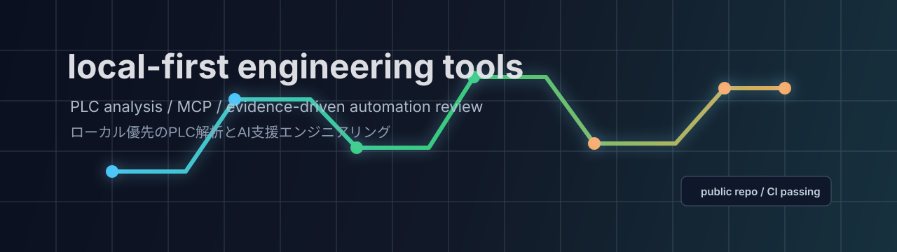

  

<h1 align="center">purinzan</h1>

  Local-first tools for PLC analysis, factory automation, and practical AI-assisted engineering.

  PLC解析、FA現場の調査、AIエージェント向けのローカルファーストな開発ツールを作っています。

  
  
  
  
  

## Featured Project

| Project | Direction | Status |
|---|---|---|
| [`gx3-cli-mcp`](https://github.com/purinzan/gx3-cli-mcp) | GX Works3 project analysis CLI and stdio MCP server | Public release / CI passing |

`gx3-cli-mcp` is an unofficial, independent tool for analyzing GX Works3 projects locally. It focuses on read-only inspection, indexed evidence, and repeatable release checks.

## 日本語

- GX Works3 (`.gx3`) プロジェクトをローカルで解析する CLI / MCP サーバーを公開しています。
- 現場データを外部に送らず、PC上でインデックス化して根拠を確認する設計です。
- AI エージェントが生ファイルを推測で読むのではなく、`query-device`、`xref`、`trace-device` などの明確な入口を使う運用を重視しています。
- MCP 側は読み取り解析を中心にし、プロジェクトを書き換える操作を公開しない方針です。

## Focus

- Building local-first engineering tools that keep production data on the user's machine.
- Turning PLC project artifacts into searchable evidence for review.
- Designing AI workflows where models use indexed facts instead of raw file guessing.
- Shipping small, practical utilities with documentation, CI, and release gates.

## Principles

- Local-first by default.
- Read-only analysis surfaces for sensitive engineering files.
- Evidence before conclusions.
- Small commands, inspectable outputs, and repeatable checks before publishing.

## Tech Stack

`Python` / `SQLite` / `MCP` / `Windows tooling` / `PLC analysis` / `automation review`

## Notes

`gx3-cli-mcp` is not affiliated with or endorsed by Mitsubishi Electric. Analysis output is advisory and should be verified in the official engineering environment before any real equipment change.
